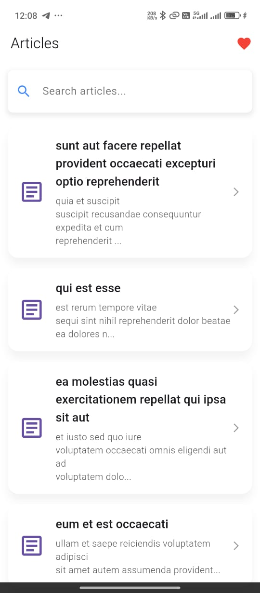
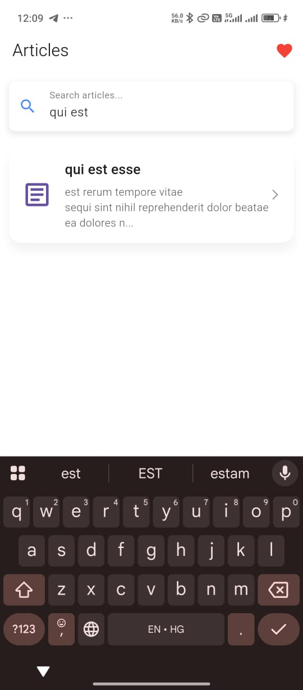
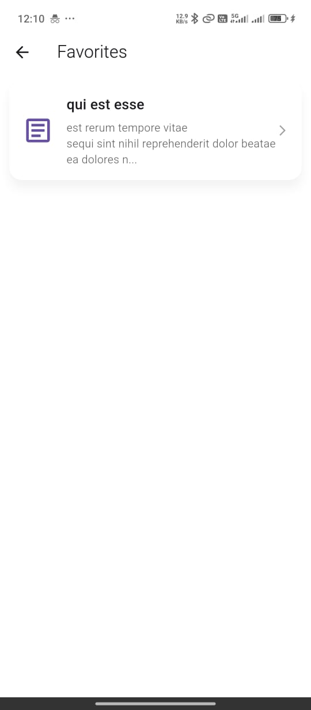

# 📰 Flutter Article App

A clean and lightweight Flutter app that fetches and displays a list of articles from a public API with search and detail views. Designed with modularity and simplicity in mind using Dio for API requests and Provider for state management.

---

## ✨ Features

- 🔄 Fetch articles from a public API
- 🔍 Client-side search by title or body
- 📄 Article detail screen with full content (title & body)
- ⚙️ Graceful error handling
- ⏳ Loading indicator while fetching
- 🔁 Pull-to-refresh support (Bonus)
- ⭐ Favorite articles with persistent local storage (Bonus)

---

## 🚀 Setup Instructions

1. **Clone the repository**:
   ```bash
   git clone https://github.com/RaviYadavO4/flutter_article_app_dio.git
   cd flutter_article_app_dio

2. **Install dependencies:**

- dio: ^4.0.0
- provider: ^6.1.1
- hive: ^2.2.3
- hive_flutter: ^1.1.0

3. **Run the app**
- flutter run


## | Tool/Library   | Purpose                            |
| -------------- | ---------------------------------- |
| Flutter SDK 3+ | Mobile UI Framework                |
| Dio            | HTTP requests for API integration  |
| Provider       | State Management                   |
| Hive           | Local data persistence (favorites) |


## 🧠 State Management Explanation

The app uses Provider with ChangeNotifier to manage application state. The ArticleProvider class handles fetching articles, managing search queries, and maintaining favorites. Widgets subscribe to state changes using Consumer or Selector, ensuring efficient and responsive UI updates.

## 📁 Folder Structure

```text
lib/
│
├── main.dart                      # App entry point
│
├── models/
│   └── article.dart               # Article model
│
├── services/
│   └── api_service.dart           # Dio logic for fetching articles
│
├── providers/
│   └── article_provider.dart      # State management with ChangeNotifier
│
├── screens/
│   ├── home_screen.dart           # Home screen with list and search
│   ├── detail_screen.dart         # Article detail view
│   └── favorites_screen.dart      # Favorites list (Bonus)
│
├── widgets/
│   ├── article_card.dart          # Reusable UI card
│   └── search_bar.dart            # Search UI
│
└── utils/
    └── hive_boxes.dart            # Hive box initialization

```


## ⚠️ Known Issues / Limitations
No pagination support (loads all posts at once)
No offline mode for articles
Favorites are stored locally only (not synced or backed up)
No error retry button (yet)

## 📸 Screenshots

<table>
  <tr>
    <td align="center">
      <strong>🏠 Home Screen</strong><br>
      
    </td>
    <td align="center">
      <strong>📄 Article Detail View</strong><br>
      
    </td>
  </tr>
  <tr>
    <td align="center">
      <strong>🔍 Search Functionality</strong><br>
      
    </td>
    <td align="center">
      <strong>📄 Favorites View</strong><br>
      
    </td>
  </tr>
</table>
 

## 🎥 Video Walkthrough

Watch the video walkthrough for a detailed overview of the app:

[](https://youtube.com/shorts/UoEfXjQz86Q)


## 👨‍💻 Author

- **Ravi Yadav**  
  [GitHub Profile](https://github.com/RaviYadavO4) • [LinkedIn Profile](https://www.linkedin.com/in/ravi-s-b1a75b212/)